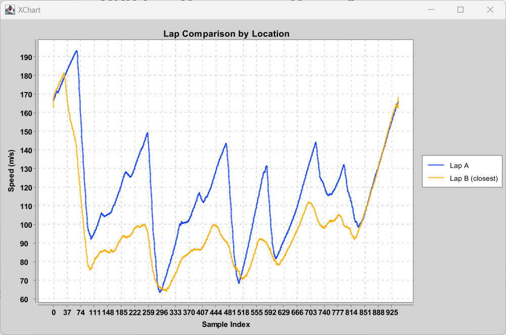

# GPS Lap Comparison Demo App
This Java application compares two racing laps using GPS data. It aligns laps based on **geographic proximity** rather than time or distance and visualizes speed differences using a line chart.

## 🚗 What It Does
- Loads GPS data from two laps (`lat, lon, speed`) stored in CSV files
- Converts GPS coordinates to UTM (metric coordinate system) using [Proj4J](https://github.com/locationtech/proj4j)
- For each point in Lap A, finds the **closest** GPS point in Lap B (spatial matching)
- Plots both lap speeds on the same chart using [XChart](https://knowm.org/open-source/xchart/)
- Uses sample index (e.g., 10Hz) on the X-axis for a fair visual comparison

## 📂 Folder Structure
```
src/
├── main/
│ ├── java/
│ │ └── LapComparisonByLocation.java
│ └── resources/
│ ├── 1m34.344s.csv
│ └── 1m53.819s.csv
```

## 📄 CSV Format
Both `1m34.344s.csv` and `1m53.819s.csv` must include a header row and three columns: `lat,lon,speed`.

Example:
```csv
lat,lon,speed
37.0000,23.0000,22.3
37.0001,23.0001,24.7
37.0002,23.0002,26.1
```

🚀 How to Run
1. Clone or download the project 
2. Make sure you have Maven installed 
3. Open a terminal and run: `mvn compile exec:java -Dexec.mainClass=LapComparisonByLocation`
4. Sample output 

🧰 Libraries Used
- Proj4J – for converting lat/lon to UTM coordinates
- XChart – for interactive plotting 
- OpenCSV – for parsing CSV files
